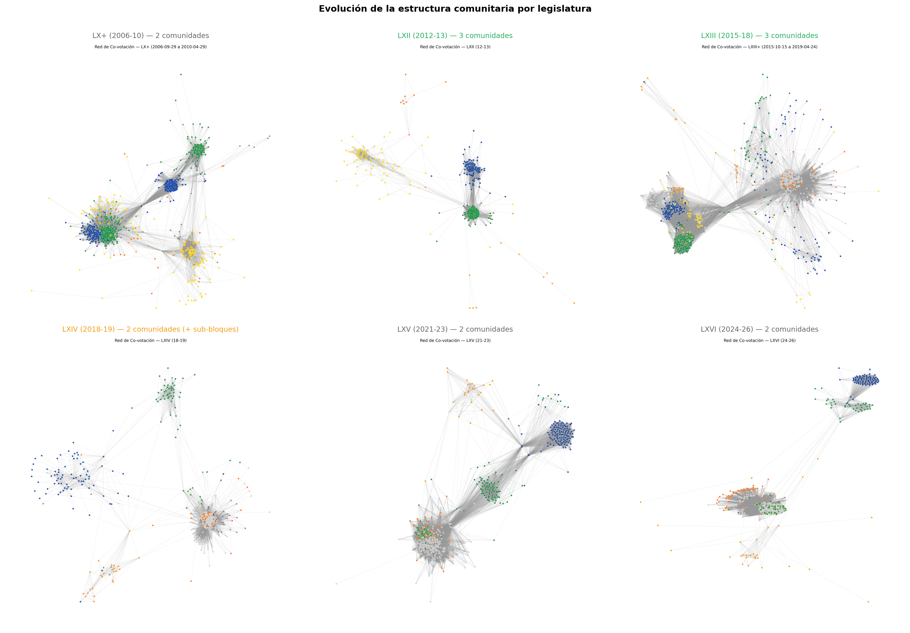
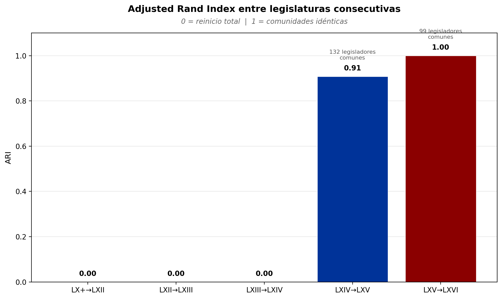
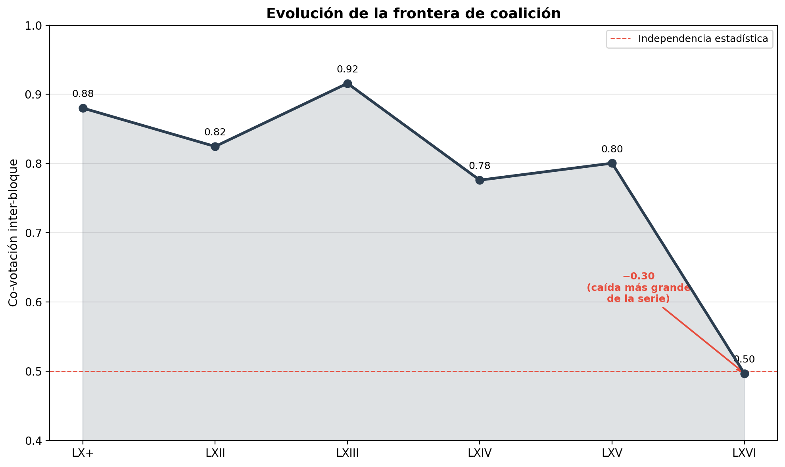
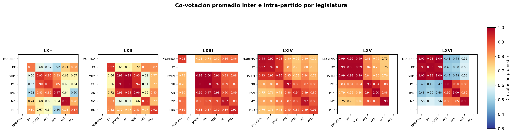

## De la fotografía al video

En los dos artículos previos de este observatorio mapeamos la LXVI Legislatura: dos bloques perfectos, disciplina arriba de 0.99 en todos los partidos y una oposición con cero poder empírico medible. Era una radiografía nítida — pero era solo eso, una radiografía.

La pregunta que queda en el aire es obvia: ¿siempre fue así? El congreso que vemos hoy — binario, rígido, predecible — es su estado natural o es el resultado de un proceso que se puede rastrear? Si la estructura de co-votación cambió con el tiempo, deberíamos poder ver dónde se rompió, dónde se consolidó, dónde se perdió la posibilidad de algo distinto.

Para responder, extendimos el análisis a 20 años de votaciones. El dataset cubre 7 legislaturas (LX a LXVI) procesadas en 6 ventanas temporales: 1,372 votaciones nominales, 971,245 votos individuales y 3,315 legisladores distintos. Cada ventana captura un periodo con suficiente densidad de votaciones para construir una red de co-votación robusta. Las primeras dos legislaturas (LX y LXI) se agrupan en una sola ventana —que llamamos LX+— por la escasez de datos votación-por-votación; el resto se procesa de forma individual. No es un dataset perfecto: hay huecos, legislaturas con pocas votaciones registradas y el sesgo inevitable de lo que se decide votar en lo abierto versus lo que se negocia en lo cerrado. Pero es suficiente para ver la tendencia.

Los artículos anteriores eran una fotografía: un corte transversal de la LXVI Legislatura, congelada en un instante. Este artículo es el video — 20 años comprimidos en 6 frames que muestran cómo mutó la estructura del congreso. No es una narrativa lineal ni una historia de progreso o decadencia. Es un intento de responder una pregunta empírica con los datos que tenemos.

---

## El congreso que ya fue distinto

El hallazgo central no es que el congreso esté polarizado. Es que no siempre lo estuvo — al menos, no de esta forma.

La LXII Legislatura (2012-2013) se organizaba en **tres comunidades**, no dos. La LXIII (2015-2018), también. El algoritmo detectaba bloques de tamaños 259/139/105 y 122/272/217 respectivamente. Esto no significa que el congreso fuera un paraíso deliberativo — significa que la estructura de la red tenía espacio para algo más que dos masas enfrentadas. Un tercer bloque, menor en tamaño, operaba como un punto de contacto o como una opción real de alineación. La política no se reducía a un sí o un no.

| Ventana | Años | Comunidades | Tamaños |
|---------|------|-------------|---------|
| LX+ | 2006-2010 | 2 | 542/467 |
| LXII | 2012-2013 | 3 | 259/139/105 |
| LXIII | 2015-2018 | 3 | 122/272/217 |
| LXIV | 2018-2019 | 2 (+2 sub-bloques Morena) | 354/153 |
| LXV | 2021-2023 | 2 | 373/158 |
| LXVI | 2024-2026 | 2 | 372/136 |

En la LXIV (2018-2019), el congreso ya colapsó a dos bloques — pero con un matiz que desapareció después: Morena se dividía internamente en **dos sub-bloques** detectados por el algoritmo. No era un monolito. Había fractura interna, suficiente para que la red la registrara como estructura significativa. Era el primer congreso de la era morenista, y el partido en el poder todavía no se había compactado. Para la LXV y la LXVI, esos sub-bloques ya no aparecen. La amalgamación se completó.

La disciplina partidista contaba otra versión de la misma historia. En las legislaturas tempranas, los partidos operaban en rangos de 0.85 a 0.95 — cohesionados, sí, pero con holgura. El PT votaba con su bloque en 84.9% de las ocasiones en la LX+. El PRD, 87.4%. El PRI, 92.8%. Ninguno rozaba el 0.99 que hoy consideramos normal. La distancia no es marginal: un partido con disciplina de 0.85 tiene quince puntos porcentuales de sus votos fuera del patrón grupal. Es otro modo de operar.

| Partido | LX+ (2006-10) | LXVI (2024-26) |
|---------|-------------|-------------|
| MORENA | — | 0.997 |
| PAN | 0.974 | 0.998 |
| PRI | 0.928 | 0.997 |
| PT | 0.849 | 0.990 |
| PVEM | 0.926 | 0.999 |
| MC | 0.979 | 0.988 |
| PRD | 0.874 | — |

La tabla anterior es brutal en su simplicidad. Cada partido, sin excepción, subió. El PT saltó de 0.849 a 0.990 — catorce puntos de disciplina ganados en dos décadas. El PRI, de 0.928 a 0.997. Hasta el PAN, que ya era disciplinado en la LX+ (0.974), encontró margen para subir a 0.998. La convergencia no es hacia la cohesión moderada sino hacia la uniformidad absoluta.

El congreso tenía aristas, matices, puentes. Un espacio donde la negociación no era ritual sino estructural — porque la red misma la hacía posible. Tres comunidades querían decir que no todo se definía en un eje. Disciplina de 0.85 quería decir que dentro de cada partido existía margen para el disenso real. Eso se terminó. El congreso que tenemos hoy es la consecuencia de un proceso de compactación que no se detuvo.

**Nota metodológica.** La modularidad de la red tiene una correlación de -0.997 con la densidad del grafo: ventanas densas (LXII, LXIII) producen modularidades de 0.03-0.08, mientras que ventanas dispersas (LX+) alcanzan 0.48. Eso hace que la modularidad no sea comparable entre legislaturas. La métrica primaria de polarización en este análisis es `frontera_coalicion` — la co-votación promedio entre pares de legisladores de bloques distintos — que sí es estable entre ventanas. La modularidad se reporta como referencia, no como indicador principal.

---

## El punto de inflexión: LXIV → LXV

Entonces, si el congreso no siempre fue así, ¿cuándo dejó de ser distinto? Para responder, necesitamos una forma de medir si la estructura de un congreso "recuerda" al anterior. Se llama Adjusted Rand Index (ARI): compara las comunidades de dos legislaturas y dice si son las mismas o se rearmaron desde cero. Cero es reinicio total. Uno es que son idénticas.

Antes de 2018, el congreso no tenía memoria.

| Transición | ARI | Legisladores comunes |
|-----------|-----|---------------------|
| LX+ → LXII | 0.00 | 0 |
| LXII → LXIII | 0.00 | 0 |
| LXIII → LXIV | 0.00 | 0 |
| **LXIV → LXV** | **0.91** | **132** |
| LXV → LXVI | 1.00 | 99 |

Cero. Cero. Cero. Y después: 0.91.

El patrón es brutal. Durante más de una década, cada nueva legislatura era un reinicio completo. La rotación entre congresos era tan alta que no había suficientes legisladores comunes para calcular el ARI. Cero personas repetían. Cada congreso era gente distinta votando en coaliciones distintas, sobre temas distintos, con aliados distintos. La estructura no persistía porque los actores no persistían.

Pero entre la LXIV y la LXV pasaron dos cosas al mismo tiempo. Primero, 132 legisladores repetían, lo cual ya era inusual por sí solo. Considera lo que significa: en las transiciones anteriores, el overlap era cero. Ni una sola persona en común. Y de repente, 132. Segundo, y más importante: esas 132 personas se agruparon casi exactamente igual que antes. El ARI de 0.91 significa que la estructura de comunidades cambió apenas un 9% entre una legislatura y la siguiente. Es la primera señal clara de que el congreso dejó de reinventarse.

El contexto político es indispensable para entender por qué. En 2018, Morena llegó al poder federal y reconfiguró todo el tablero. Las legislaturas LXII y LXIII tenían 3 comunidades. Eran la estructura tripartita del México priísta-panista-perredista, ya débil, con modularidad bajísima (0.03), pero visible en los datos. A partir de la LXIV, esa estructura colapsó. Solo quedan 2 comunidades.

Pero la LXIV no fue el final del proceso. Fue el inicio. Morena aún no era monolítico en esos primeros meses de gobierno. Louvain detectó 2 sub-bloques internos dentro de la coalición morenista. El partido en el poder todavía se fragmentaba al votar. Era un sistema bipolar, pero con fracturas internas que la red mostraba claramente.

La LXV sella esas fracturas. La oposición, que durante décadas se había dividido entre PAN, PRI, PRD y otros partidos menores, cristaliza como bloque único. Todos votan juntos contra Morena. Del otro lado, Morena y sus aliados cierran filas y eliminan las divisiones internas. Las 2 comunidades pasan de ser una tendencia a ser una estructura fija. La modularidad sube de 0.04 a 0.05, y las comunidades se vuelven más nítidas.

Por primera vez en los datos, el congreso "recuerda" cómo estaba organizado. Los bloques de poder dejaron de reconfigurarse y empezaron a repetirse. Y eso fue solo el principio.

---

## La congelación: LXV → LXVI

Si la LXV fue el congreso que aprendió a recordar, la LXVI fue el que dejó de moverse.

El dato más revelador de toda la serie histórica tiene solo tres caracteres: ARI = 1.0.

Comunidades idénticas. Cero cambios entre una legislatura y la siguiente. Ni un solo legislador común abandonó su bloque. Esto no había pasado nunca en los datos disponibles, y honestamente es un resultado que uno no espera ver en un congreso con 531 legisladores.

99 legisladores repitieron entre la LXV y la LXVI. Los 99 votaron con el mismo bloque. No hubo tránsfugas, no hubo realineaciones, no hubo sorpresas. La persistencia de 99 legisladores entre dos congresos ya es notable en sí misma, considerando que antes de la LXIV el overlap era literalmente cero. Pero lo extraordinario no es que repitieran, sino que ninguno cambiara de bando.

La disciplina partidista trepó a niveles sin precedentes:

| Partido | LXV (2021-23) | LXVI (2024-26) |
|---------|-------------|-------------|
| MORENA | 0.988 | 0.997 |
| PAN | 0.997 | 0.998 |
| PRI | 0.982 | 0.997 |
| PT | 0.992 | 0.990 |
| PVEM | 0.991 | 0.999 |
| MC | 0.993 | 0.988 |

MORENA, PAN, PRI y PVEM superan 0.997. Los únicos que bajan ligeramente son PT (de 0.992 a 0.990) y MC (de 0.993 a 0.988). Pero incluso esos están en 0.988 o por encima. El piso de disciplina se elevó para todos. Cuando el peor disciplinado de la cámara está en 0.988, estás viendo un congreso que no negocia internamente.

Y después está la frontera de coalición. En la LXV era 0.80: los bloques cooperaban el 80% del tiempo. En la LXVI cayó a 0.50. Es la caída más abrupta de toda la serie histórica por un margen amplio. La anterior variación grande fue de 0.92 a 0.78 (LXIII a LXIV), pero esa fue una reconfiguración del tablero completo. Esta vez la estructura se mantuvo idéntica, y la cooperación entre bloques se desplomó igual.

El congreso se fosilizó. Mismas comunidades, disciplina perfecta, bloques que dejaron de negociar. El mapa de alianzas se rigidizó por completo. Lo que emergió en 2018 no solo persistió: se congeló. Y si la frontera de coalición confirma que los bloques dejaron de cooperar, el ARI = 1.0 confirma algo más inquietante: ya no hay forma de que el congreso se reorganice desde adentro. Los mismos actores, en los mismos bloques, votando de la misma manera. Congelamiento no es lo mismo que estabilidad. Es rigidez.

---

## La frontera que desapareció

Frontera 0.50 no significa que los bloques voten uno contra el otro. Significa algo más radical: no se miran.

La frontera de coalición se calcula como la co-votación promedio entre pares de legisladores de bloques distintos. Es una medida directa de cooperación inter-bloque. Un valor de 0.50 es lo que obtendrías si dos grupos tiraran monedas independientes: la mitad del tiempo coinciden, la mitad no. En términos estadísticos, es **independencia**. Los bloques no votan "en contra" del otro. Votan sin que el otro importe.

Esto es una distinción clave. Oposición sistemática sería un valor cercano a 0: los bloques votan deliberadamente diferente. Cooperación sería un valor cercano a 1. Pero 0.50 no es ni lo uno ni lo otro. Es la ausencia de relación. Es como si cada bloque habitara un universo legislativo separado.

La caída de la frontera no tiene precedente en la serie. Así se ve la evolución completa:

| Ventana | Años | Frontera coalición | Interpretación |
|---------|------|-------------------|----------------|
| LX+ | 2006-2010 | 0.88 | Alta cooperación inter-bloque |
| LXII | 2012-2013 | 0.82 | Cooperación sustancial |
| LXIII | 2015-2018 | 0.92 | Cooperación casi total |
| LXIV | 2018-2019 | 0.78 | Cooperación decreciendo |
| LXV | 2021-2023 | 0.80 | Cooperación moderada |
| LXVI | 2024-2026 | 0.50 | Independencia estadística |

De LX+ a LXV, la frontera oscila entre 0.78 y 0.92. Hay variación, pero el rango es estrecho y los valores son altos. En la LXIII, los bloques cooperaban el 92% del tiempo. En la LXVI, el 50%. No hubo un declive gradual. Fue un colapso concentrado en una sola transición: de 0.80 a 0.50 entre la LXV y la LXVI. La diferencia más grande anterior era de 0.14 puntos (LXIII a LXIV). Esta es de 0.30.

El heatmap de co-votación partido por partido por legislatura lo muestra sin necesidad de interpretación. Los píxeles entre bloques pasan de amarillo — alta coincidencia — a azul oscuro — baja coincidencia — en la transición a LXVI. No es un gradiente que se desvanece. Es un interruptor que se apaga.

Pensémoslo en términos concretos. En la LXIII, si tomabas un diputado de la coalición y uno de la oposición al azar, había 92% de probabilidad de que hubieran votado igual en cualquier votación dada. Negociaban, cedían, construían acuerdos. En la LXVI, esa probabilidad es del 50%. Es literalmente azar. El bloque coalición vota su agenda y el bloque oposición vota la suya, y ninguno ajusta su voto en función de lo que el otro hace.

La cooperación inter-bloque, tal como la medimos, dejó de existir. Y lo que la reemplazó no es conflicto. Es indiferencia.

---

## ¿Y ahora qué?

Un congreso congelado, ¿es permanente o cíclico?

La serie histórica ofrece un antecedente. Antes del congelamiento actual hubo tres reinicios totales consecutivos: las transiciones LX+ a LXII, LXII a LXIII, y LXIII a LXIV registraron un ARI de 0.00. Eso significa que entre una legislatura y la siguiente, cero legisladores se quedaron. La composición cambió por completo. Y sin embargo, el sistema encontró su equilibrio cada vez: dos o tres comunidades, modularidad baja, frontera alta. El congreso ha demostrado capacidad de reinventarse.

Entonces, ¿qué tendría que pasar para que el congelamiento se rompa? Los datos sugieren tres escenarios hipotéticos — no predicciones, sino mecanismos observables:

**Primero, cambio en la composición partidista.** Si un tercer bloque viable emerge con suficiente masa para ser pivote en votaciones calificadas, la dinámica binaria actual se complica. El precedente está en la LXII y LXIII, donde Louvain detectó 3 comunidades. Más bloques significan más combinaciones posibles de coalición, y eso reduce la modularidad.

**Segundo, fractura interna de alguno de los bloques.** En la LXIV, Morena ya mostró sub-bloques en el análisis de co-votación dinámica. Si esa fractura se profundiza hasta generar dos grupos con patrones de voto diferenciados, el mapa vuelve a ser multipolar. La lista de disidentes de la LXVI tiene casos notables: la diputada Mendoza Arias, registrada como Independiente, tiene co-votación intra de 0.000 con su grupo. Jiménez Zamora (PAN) tiene 0.953. Ramírez Reyes (MC) tiene 0.969. Son excepciones que no forman facción — hoy. Pero son las semillas de lo que podría cambiar.

**Tercero, cambio en las reglas de disciplina partidista.** La disciplina perfecta es una condición necesaria para el congelamiento. Si las reglas internas de los partidos se flexibilizan — por reforma estatutaria o por presión electoral — la modularidad del grafo cambia. Cuando la co-votación intra-partido deja de ser 0.999, los bloques se vuelven porosos.

El observatorio sigue corriendo. Los datos de la LXVI siguen creciendo con cada periodo legislativo, y las siguientes legislaturas alimentarán nuevas ventanas de análisis. En el plano metodológico, los próximos pasos son NOMINATE para mapear el posicionamiento ideológico dinámico de cada legislador, y redes temporales con mayor resolución para capturar cambios dentro de una misma legislatura.

Estos resultados tienen limitaciones que vale la pena hacer explícitas. Seis ventanas no cubren todas las legislaturas posibles — la LXI, por ejemplo, no tiene datos nominales suficientes para construir una ventana independiente. No todas las votaciones del Congreso son nominales: se necesitan 6 legisladores para solicitar votación nominal, lo que introduce un sesgo documentado hacia votaciones contenciosas. Y todo esto es Cámara de Diputados, no Senado. Además, el ARI solo se puede computar cuando hay overlap de legisladores entre ventanas consecutivas; antes de la LXIV, ese overlap no existe, lo que limita la comparabilidad de las primeras tres transiciones.

Los datos seguirán creciendo. Los métodos se refinarán. Y los patrones podrían cambiar. Pero con lo que tenemos hoy, el diagnóstico es claro: en 20 años de votaciones nominales, la LXVI Legislatura registró la cooperación inter-bloque más baja de la serie. No hubo conflicto. Hubo desconexión. Y el observatorio sigue observando.

---

## Fuentes

- *[Blondel et al. (2008)](https://doi.org/10.1088/1742-5468/2008/10/P10008)* — "Fast unfolding of communities in large networks" — algoritmo Louvain para detección de comunidades en grafos de co-votación
- *[Hubert & Arabie (1985)](https://doi.org/10.1007/BF01908075)* — "Comparing partitions" — Adjusted Rand Index para comparar estructuras de comunidades entre legislaturas
- *[Poole & Rosenthal (1985)](https://doi.org/10.2307/1960888)* — "A Spatial Model for Legislative Roll Call Analysis" — método NOMINATE para posicionamiento ideológico de legisladores
- *[Ainsley et al. (2020, APSR)](https://doi.org/10.1017/S0003055420000397)* — umbral de 6 legisladores para solicitar votación nominal en México y sesgo de selección documentado
- *Sistema de Información Legislativa de la Cámara de Diputados* — datos de votaciones nominales scrapeados para las legislaturas LX a LXVI
